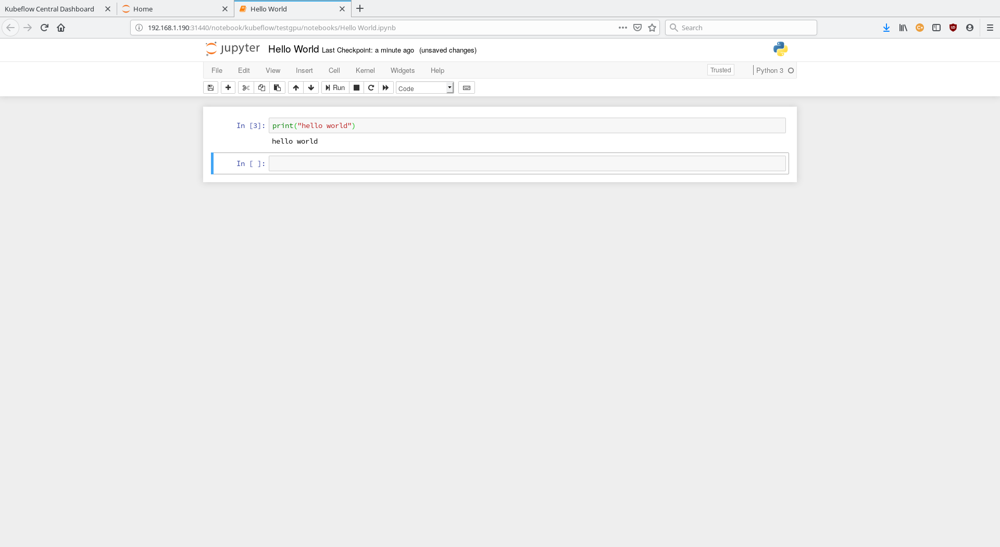

This is the result from my hackweek project: https://hackweek.suse.com/projects/architecting-a-machine-learning-project-with-suse-caasp

    Disclaimer

    This is a hackweek project, so this is not ready for production use.
    It contains hacks and workarounds just to "make it work".

    This has been tested with SUSE CaaSP Beta 3 (public beta).
    I used that "kubernetes distribution" because given I am involved on that project,
    I am familiar with it (and I love it :) )

    However, instructions here should be also valid openSUSE Kubic and in general for
    any kubernetes+cri-o distribution

# Architecture

The architecture is *Kubeflow* on top of *SUSE CaaSP* on top of *NVIDIA GPUs and libraries*.

Kubeflow contains several components to help you model, train, and deploy your models as microservices.

Kubeflow sits on *Keras* and *Tensorflow*.

The glue between Kubernetes, Tensorflow and NVIDIA Hardware is the *"NVIDIA Kubernetes device plugin"*.

<table style="text-align: center">
<tr>
<td colspan="2">jupyter notebooks (model and train)</td><td>seldom (deploy as microservice)</td><td>kubeflow dashboard</td><td rowspan="4">Kubeflow</td>
</tr>
<tr>
<td>Data</td><td>ML model</td><td>ML model</td>
</tr>
<tr>
<td colspan="4">Keras</td>
</tr>
<tr>
<td colspan="4">Tensorflow</td>
</tr>
<tr>
<td colspan="6">NVIDIA kubernetes device plugin </td>
</tr>
<tr>
<td colspan="4"> kubernetes </td> <td rowspan="3"> SUSE CaaSP v4</td>
</tr>
<tr>
<td colspan="4"> cri-o </td>
</tr>
<tr>
<td colspan="4"> cri-o OCI hook </td>
</tr>
<tr>
<td colspan="4"> nvidia-container-runtime-hook </td> <td rowspan="4">NVIDIA</td>
</tr>
<tr>
<td colspan="4"> nvidia-container-cli </td>
</tr>
<tr>
<td colspan="4"> libnvidia-container </td>
</tr>
</tr>
<tr>
<td colspan="4"> nvidia-drivers (kernel and CUDA) </td>
</tr>
<tr>
<td colspan="5"> NVIDIA Quadro K2000 GPU </td>
</tr>
</table>

See setup in 3 steps:

* https://github.com/jordimassaguerpla/SUSE_hackweek_18/blob/master/01-How_to_setup_SUSE_CaaSP_kubernetes_crio_GPU.md
* https://github.com/jordimassaguerpla/SUSE_hackweek_18/blob/master/02-How_to_deploy_kubeflow.md
* https://github.com/jordimassaguerpla/SUSE_hackweek_18/blob/master/03-Deploying_a_KF_example_with_Keras_%20Tensorflow_%20and_Seldon.md

# Results and conclusions

It was possible to deploy this architecture and train a model for github issues summarization.

See an example jupyter notebook:

This is the test that the microservice works:

>  kubectl port-forward svc/ambassador -n kubeflow 8080:80
>
>  curl -X POST -H 'Content-Type: application/json' -d '{"data":{"ndarray":[["issue overview add a new property to disable detection of image stream files those ended with -is.yml from target directory. expected behaviour by default cube should not process image stream files if user does not set it. current behaviour cube always try to execute -is.yml files which can cause some problems in most of cases, for example if you are using kuberentes instead of openshift or if you use together fabric8 maven plugin with cube"]]}}' http://localhost:8080/seldon/issue-summarization/api/v0.1/predictions

>{
  "meta": {
    "puid": "d8e0ljfmf0apl1b205vr7lddqs",
    "tags": {
     },
     "routing": {
     },
     "requestPath": {
       "issue-summarization": "docker.io/jordimassaguerpla/gh_issue_summarization:0.3"
      },
      "metrics": []
   },
   "data": {
     "names": ["t:0"],
     "ndarray": [["add a build from the the the error"]]
 }
>

We reused some packages from CentOS. We would need to package these for SUSE:

* libnvidia-containers
* nvidia-containers-runtime-hook

Note we are using upstream containers and not SUSE based containers.
